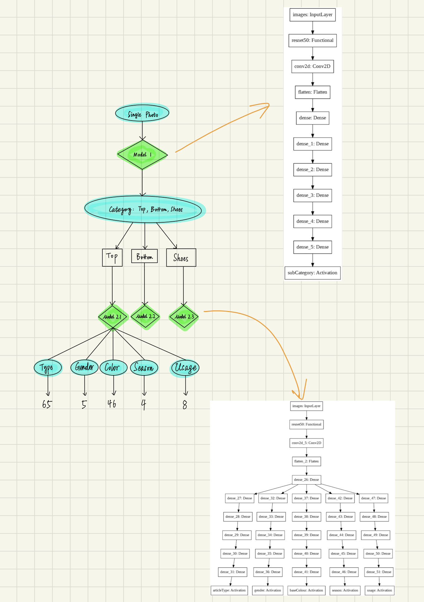
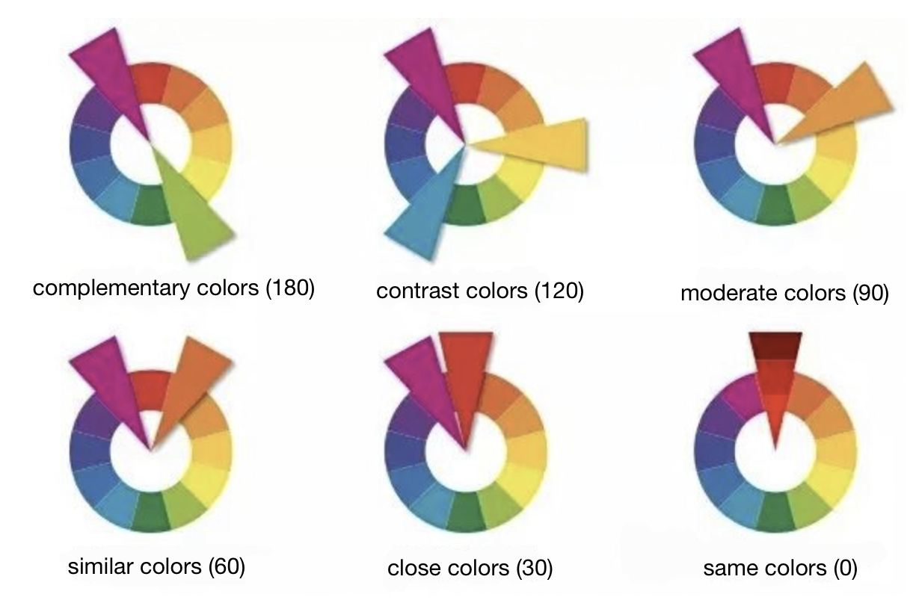

# Contents

[1. Intro](#1)

[2. Use the app](#2)

[3. Models](#3)

[4. Recommendation](#4)

[5. Limitations](#5)

[6. Start the app](#6)

[7. Repo structure](#7)


<h2 id="1">1. Intro</h2> Do you sometimes (definitely not during the final exams week) stand in front of your closet and think deeply about "what should I wear today?!", "how do I pair up clothes today to make me more fashionable?!". Everyone defines fashion personally, but there are always some methods and ways that are fashionable for most people. What a person wears can also clearly show how that person's character and taste are. People who don't have time to think about this may need to use an app to improve their sense of fashion, such as an outfit recommendation app. In general, we have implemented such a local app which can store photo of clothes owned by users and recommend what to wear (top, bottom, and shoes) today.

<br>
<h2 id="2">2. Use the app</h2> Using this app, users can choose to add a photo from their computer (we need users to take a photo of their clothes and store it on the computer) to our app. In the process of adding pictures, this picture will be automatically recognized by our pre-trained model at one time, by type (such as T-shirt), gender (such as women), color (such as navy blue), season (such as summer), usage (such as formal, casual, sport, etc.), and path of the photo. These six types of information will be stored in the app and displayed for the user to refer to. Considering that our model is sometimes inaccurate, we also provide users with editing and deleting buttons to facilitate user operations. Therefore, the user can edit the information we misidentified or delete a piece of clothing.

We have a "Generate Today's Outfit Recommendations" button, providing users with recommendations. The recommended result is composed of three pictures, namely top, bottom, and shoes. Of course, these three pictures are the user's clothes.

Below is a functional diagram of using our app:


<br>
<h2 id="3">3. Models</h2> Behind such an app, we have four neural network models and a recommendation system.

For our neural network models: The first model (with accuracy over 99%) is used to identify whether the clothes are tops, bottoms, or shoes. After this, the photo will be directed to one of the other three models based on the results of the first model (please see the picture below). These three similar but not exactly the same models (with overall accuracy around 80% ) will identify type(65), gender(5), color(46), season(4), and usage(8).

Below is a flow chart of our recognition process:



<br>
<h2 id="4">4. Recommendation</h2> For the recommendation process: 
The program randomly selects a top, and we look for the same gender, the same season, and the same usage in the bottoms and shoes stored in the app. After this, we recommend outfits based on the color. Our recommended method for color is based on such a color wheel. We summarized the 46 colors in the data set into 12 colors in the figure, plus three colors of black, white, gray, and multi-color, recommending according to the angle between the colors.



<br>
<h2 id="5">5. Limitations</h2>
First of all, although our data is huge and the accuracy of the test set is very high, we found that our program is not suitable for all the pictures we randomly searched from Google. Therefore, we think our data is with bias, which is discussed in "A special explanation for data cleaning and analysis(bias).ipynb". In addition, it seems partial to be due to changes in people's thinking about fashion, or perhaps because the dataset is relatively old. 


<br>
<h2 id="6">6. Start the app</h2>

To start the app: 

Check python version and pip version.

Project was running on my machine with environment details as:
```
python --version
pip --version
```
- Python : 3.8.10
- pip : 3.8

a) First download models from [Google Drive Folder](https://drive.google.com/drive/folders/1cIID51--8h882p04Nv0VkBPuHlB804xq?usp=sharing) and store it in models folder.

b) Create virtual environment for safer side

c) Run virtual environment:
```
.venv\Scripts\activate
```

d) Install all the packages:
```
pip install -r requirements.txt
```

e) Next, type the following code in any Python environment:
to start environment:

```
python   
``` 

Then once  you have started the Python environment and >>> is visible type:

```
from py.ui_module import*
run_ui()    
```   

f) Then you will see the app!

### How to Use the App

1. **Upload Images:** Obtain images from anywhere on your device.
2. **Dataset:** If you need a dataset, you can download one from [Kaggle](https://www.kaggle.com/datasets/paramaggarwal/fashion-product-images-small?resource=download).
3. **Usage:** Follow the instructions provided in the app to upload the images and use the application.
4. **To edit or delete any record first select it and then press buttons provided on UI.**

<h2 id="7">7. Repo structure</h2>

```
.
├── A special explanation for data cleaning and analysis(bias).ipynb   # A note that analyzes bias of the data set used in this project
├── LICENSE   # The license
├── README.md   # The readme file
├── model details   # This folder contains everything related to the models: data, models themselves, training code
│   ├── data   # Data for training models from Kaggle
│   ├── models   # A google drive folder which contains our trained models
│   │   ├── model_sub   # A model that distinguishes tops, bottoms, and shoes
│   │   ├── model_top   # A model that recognizes the type, color, gender, season, and usage of tops
│   │   ├── model_bottom   # A model that recognizes the type, color, gender, season, and usage of bottoms
│   │   └── model_shoes   # A model that recognizes the type, color, gender, season, and usage of shoes
│   ├── train_module.py   # A module which contains functions we used to train the models
│   └── training.py   # Steps that we train the models
├── models
│   ├── model_sub   # A model that distinguishes tops, bottoms, and shoes
│   ├── model_top   # A model that recognizes the type, color, gender, season, and usage of tops
│   ├── model_bottom   # A model that recognizes the type, color, gender, season, and usage of bottoms
│   └── model_shoes   # A model that recognizes the type, color, gender, season, and usage of shoes
├── pictures   # Pictures used in this repo
│   ├── 51109bb074d95c059f716e48786568f.jpg   
│   ├── IMG_0159.jpg   
│   ├── top_question.png   
│   └── tutorial.png   
├── py   # All you need to run the app
│   ├── recognition_module.py   # A module that contains functions and classes to generate the GUI
│   └── ui_module.py   # A module that contains the function to run the app
└── requirements.txt # The packages
```
